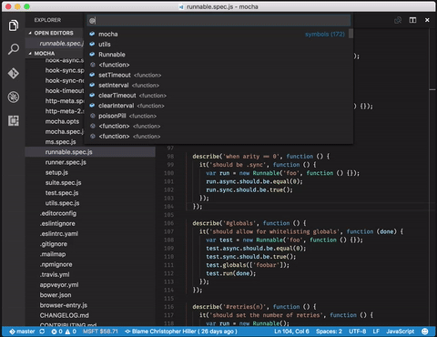
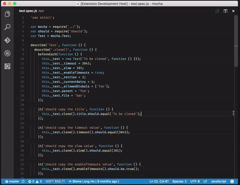

# Unit Test Navigate

Adds your unit test definition calls to the symbols list for easier navigation of javascript and typescript unit test scripts. Supports `describe`, `it`, `suite`, and `test` calls.

Before:

After:

